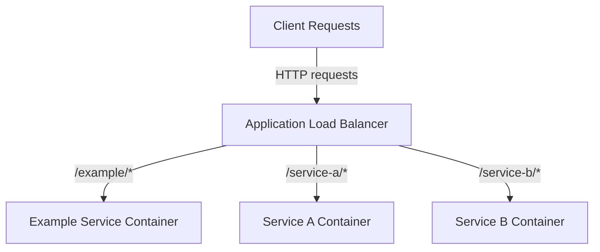

# We The People and Just The People - Microservice Architecture

This project implements a microservice architecture where each service is contained in its own directory and deployed independently. An application load balancer routes traffic to the appropriate microservice based on the URL path.

## Architecture Overview



## How It Works

- **URL-based Routing**: The load balancer routes requests based on URL paths
  - Example: `/example` routes to the example service's `/` endpoint
  - Example: `/example/users` routes to the example service's `/users` endpoint
  - Example: `/service-a/orders` routes to service-a's `/orders` endpoint

- **Independent Deployment**: Each microservice is containerized and deployed separately
  - Updates to one service don't require redeploying other services

## Directory Structure

```
back-end-services/
├── example/             # Example microservice template
├── service-a/           # Another microservice
├── service-b/           # Another microservice
├── .github/workflows/   # CI/CD workflows
└── README.md            # This file
```

## Creating a New Microservice

1. Copy the `example` directory to create a new service:
   ```bash
   cp -r example my-new-service
   ```

2. Update the package.json, README, and code in the new directory

3. Implement your service logic in the `src` directory

4. Deploy your service (see Deployment section)

5. Configure the load balancer to route `/my-new-service/*` traffic to your service

## Development Workflow

Each microservice follows its own development lifecycle:

1. Clone the repository
2. Navigate to your service directory
3. Install dependencies: `npm install`
4. Make code changes
5. Run tests: `npm test`
6. Submit PR for review

## Deployment

Each microservice is containerized using Docker:

1. Build the service image:
   ```bash
   cd my-service
   docker build -t my-service .
   ```

2. Deploy the container to your infrastructure (Kubernetes, ECS, etc.)

3. Configure the load balancer to route traffic with the path prefix `/my-service/*` to the container

## CI/CD Pipeline

The GitHub Actions workflow:

1. Triggers on pull requests
2. Identifies directories with Dockerfiles that have been modified
3. For each modified service:
   - Installs dependencies
   - Runs tests
   - Builds the Docker image (on merge to main)

## Load Balancer Configuration

The application load balancer should be configured with path-based routing:

- Path pattern: `/service-name/*`
- Target: Service container for `service-name`
- Path rewrite: Strip `/service-name` prefix (implementation depends on your load balancer)

## Best Practices

- Each service should be self-contained
- Use the standard middleware for consistent request handling
- Implement thorough tests for each service
- Document API endpoints in each service's README

## License

[Include license information here]